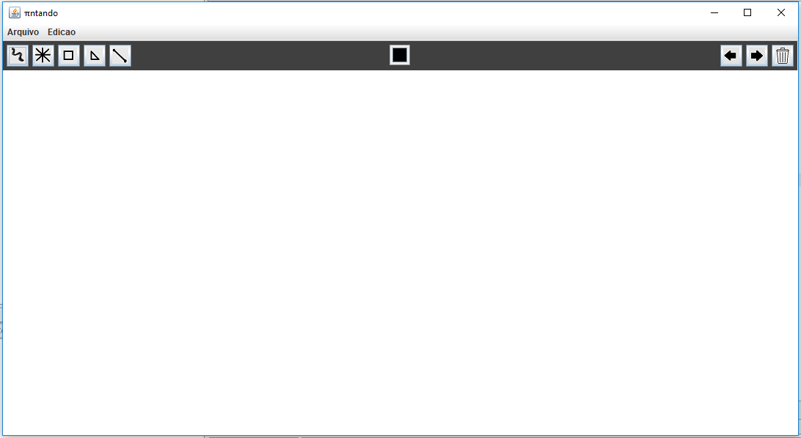
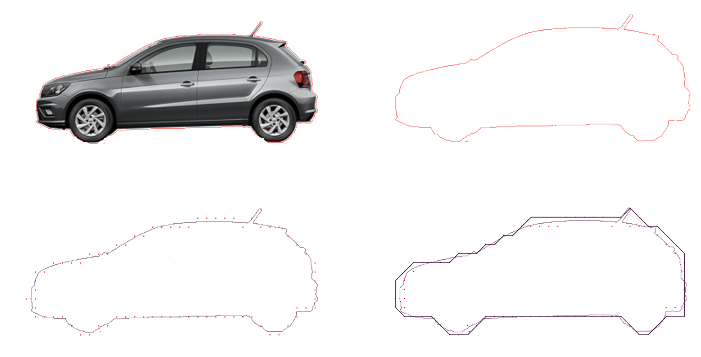

# Graphic Project

This is a graphic software developed in a project of the University of São Judas Tadeu, whose objective is to draw figures from geometric shapes, save them and have the possibility to load an existing project.

## First Phase

The initial phase was based on the Freeman chain code of eight directions. 

  

The decision-making of the algorithm is based on the following Cartesian plane system

  

## Second Phase

The second phase was based on a book¹ and had the initial code provided by Professor Carlos Menezes.

## Third Phase

Studying the contents of the book¹ was made a new interface with several functionalities, being carried out a complete refactoring of the code. See some code screens:

### Main Page

  

### Import an image

  

## Getting Started

### Prerequisites

Before you can run the application, make sure that you have the following software installed:
* [JDK](http://www.oracle.com/technetwork/java/javase/downloads/index.html)
* [Java IDE](https://netbeans.org/downloads/8.0.1/) (Highly Recommended NetBeans)

## Contributing

Please read [CONTRIBUTING.md](CONTRIBUTING.md) for details on our code of conduct, and the process for submitting pull requests to us.

## Versioning

We use [SemVer](http://semver.org/) for versioning. For the versions available, see the [tags on this repository](https://github.com/ecjN00B/usjt-graphic-project/tags).

## Authors

* **Arthur Regis** - [arthuregis](https://github.com/arthuregis)
* **Bruno Luiz Mendes** - [blmendes](https://github.com/blmendes)
* **Elias de Carvalho Junior** - [ecjN00B](https://github.com/ecjN00B)
* **Guilherme Alves Amaro** - [guui-alves](https://github.com/guui-alves)

See also the list of [contributors](https://github.com/ecjN00B/usjt-graphic-project/contributors) who participated in this project.

## License

This project is licensed under the Apache License 2.0 - see the [LICENSE.md](LICENSE.md) file for details

## References

[1] KOFFMAN, ELLIOT B. Objetos, Abstração, Estruturas de Dados e Projeto usando JAVA 5.0, 1. Ed.,São Paulo: LTC, 2008.
